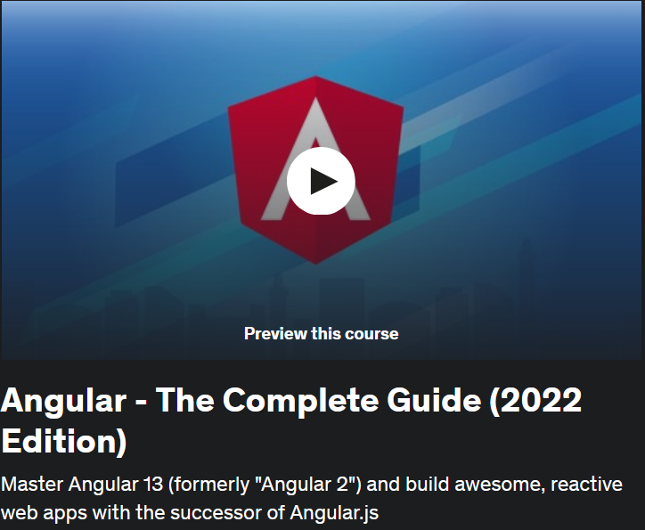

## Angular - The Complete Guide (2022 Edition)

My OS will be Windows 10, so some notes are based on this operating system. This contains exercise files and my own notes alongside with them.
 

All course material from **Angular - The Complete Guide (2024 Edition)** by Maximilian Schwarzmüller

If the content sparked :fire: your interest, please consider buying the course and start learning :book:

[The Course at Udemy](https://www.udemy.com/course/the-complete-guide-to-angular-2/)   
[Acade Mind](https://academind.com/)   

**Note: The material provided in this repository is only for helping those who may get stuck at any point of time in the course. It is very advised that no one should just copy the solutions(violation of Honor Code) presented here.**

<!-- 
Linkedin puts this shit front, when clicking from private mode x(. Need to put this to make jump working every case
?trk=public_profile_see-credential 
-->

Insert certificate here when completed

## Progress

- [x] [Section 01](https://github.com/developersCradle/angular-complete-guide/tree/main/Section%201%20Gettings%20Started) - Getting Started
- [x] [Section 02](https://github.com/developersCradle/angular-complete-guide/tree/main/Section%202%20The%20Basics) - The Basics 
- [x] [Section 03](https://github.com/developersCradle/angular-complete-guide/tree/main/Section%203%20Course%20Project%20-%20The%20Basics) - Course Project - The Basics
- [x] [Section 04](https://github.com/developersCradle/angular-complete-guide/tree/main/Section%204%20Debugging) - Debugging
- [ ] [Section 05](https://github.com/developersCradle/angular-complete-guide/tree/main/Section%205%20Components%20%26%20Databinding%20Deep%20Dive) - Components & Data binding Deep Dive
- [ ] [Section 06](#) - Course Project - Components & Data binding
- [ ] [Section 07](#) - Directives Deep Dive
- [ ] [Section 08](#) - Course Project - Directives
- [ ] [Section 09](#) - Using Services & Dependency Injection
- [ ] [Section 10](#) - Course Project - Services & Dependency Injection
- [ ] [Section 11](#) - Changing Pages with Routing
- [ ] [Section 12](#) - Course Project - Routing 
- [x] [Section 13](https://github.com/developersCradle/angular-complete-guide/tree/main/Section%2013%20%20Understanding%20Observables) - Understanding Observables
- [ ] [Section 14](#) - Course Project - Observables
- [ ] [Section 15](https://github.com/developersCradle/angular-complete-guide/tree/main/Section%2015%20Handling%20Forms%20in%20Angular%20Apps) - Handling Forms in Angular Apps
- [ ] [Section 16](#) - Course Project - Forms
- [x] [Section 17](https://github.com/developersCradle/angular-complete-guide/tree/main/Section%2017%20Using%20Pipes%20to%20Transform%20Output) - Using Pipes to Transform Output 
- [ ] [Section 18](#) - Making Http Requests 
- [ ] [Section 19](#) - Course Project - Http
- [ ] [Section 20](#) - Authentication & Route Protection in Angular
- [ ] [Section 21](#) - Dynamic Components
- [ ] [Section 22](#) - Angular Modules & Optimizing Angular Apps
- [ ] [Section 23](#) - Deploying an Angular App 
- [ ] [Section 24](#) - Standalone Components
- [ ] [Section 25](#) - Angular Signals
- [ ] [Section 26](#) - Bonus: Using NgRx For State Management
- [ ] [Section 27](#) - Bonus: Angular Universal
- [ ] [Section 28](#) - Angular Animations
- [ ] [Section 29](#) - Adding Offline Capabilities with Service Workers
- [ ] [Section 30](#) - A Basic Introduction to Unit Testing in Angular Apps
- [ ] [Section 31](#) - Angular as a Platform & Closer Look at the CLI
- [ ] [Section 32](#) - Angular Changes & New Features
- [ ] [Section 33](#) - Course Roundup
- [x] [Section 34](https://github.com/developersCradle/angular-complete-guide/tree/main/Section%2033%20TypeScript%20Introduction%20(for%20Angular%202%20Usage)) - TypeScript Introduction (for Angular 2 Usage)

- todo fix the forms chapter viewChild thing

## Summary

- [ ] Lastly thought Angular documents as refreshment 
- [ ] some minor angular project, magic/religious calendar app just for fun