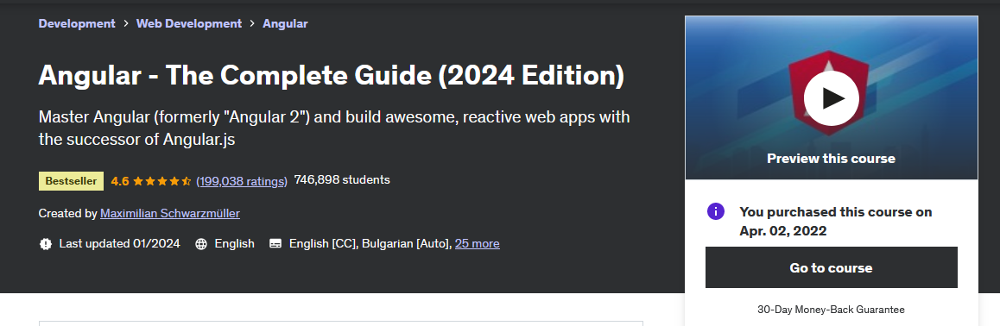

## Angular - The Complete Guide (2022 Edition)

My OS will be Windows 10, so some notes are based on this operating system. This contains exercise files and my own notes alongside with them. 

All course material from Angular - The Complete Guide (2022 Edition) by Maximilian Schwarzmüller

[The Course at Udemy](https://www.udemy.com/course/the-complete-guide-to-angular-2/)   

Insert certificate here when completed

## Progress

- [x] [Section 01](https://github.com/developersCradle/angular-complete-guide/tree/main/Section%201%20Gettings%20Started) - Getting Started
- [x] [Section 02](https://github.com/developersCradle/angular-complete-guide/tree/main/Section%202%20The%20Basics) - The Basics 
- [x] [Section 03](https://github.com/developersCradle/angular-complete-guide/tree/main/Section%203%20Course%20Project%20-%20The%20Basics) - Course Project - The Basics
- [x] [Section 04](#) - Debugging
- [ ] [Section 05](#) - Components & Data binding Deep Dive
- [ ] [Section 06](#) - Course Project - Components & Data binding
- [ ] [Section 07](#) - Directives Deep Dive
- [ ] Section 08 - 
- [ ] Section 09 - 
- [ ] Section 10 - 
- [ ] Section 11 - 
- [ ] Section 12 - 
- [ ] Section 13 - 
- [ ] Section 14 - 
- [ ] [Section 15](https://github.com/developersCradle/angular-complete-guide/tree/main/Section%2015%20Handling%20Forms%20in%20Angular%20Apps) - Handling Forms in Angular Apps
- [ ] Section 16 - 
- [x] [Section 17](https://github.com/developersCradle/angular-complete-guide/tree/main/Section%2017%20Using%20Pipes%20to%20Transform%20Output) - Section 17: Using Pipes to Transform Output 
- [ ] Section 18 - 
- [ ] Section 19 - 
- [ ] Section 20 - 
- [ ] Section 21 - 
- [ ] Section 22 - 
- [ ] Section 23 - 
- [ ] Section 24 - 
- [ ] Section 25 - 
- [ ] Section 26 - 
- [ ] Section 27 - 
- [ ] Section 28 - 
- [ ] Section 29 - 
- [ ] [Section 30](#) - Angular as a Platform & Closer Look at the CLI
- [ ] [Section 31](#) - Angular Changes & New Features
- [ ] [Section 32](#) - Course Roundup
- [x] [Section 33](https://github.com/developersCradle/angular-complete-guide/tree/main/Section%2033%20TypeScript%20Introduction%20(for%20Angular%202%20Usage)) -  TypeScript Introduction (for Angular 2 Usage)
- Add more when time comes
