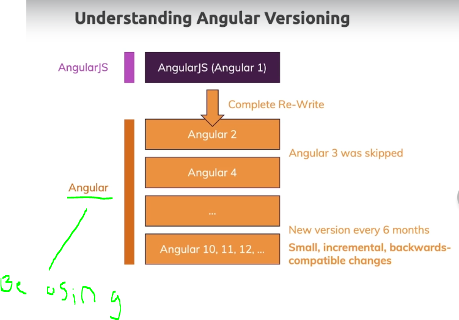
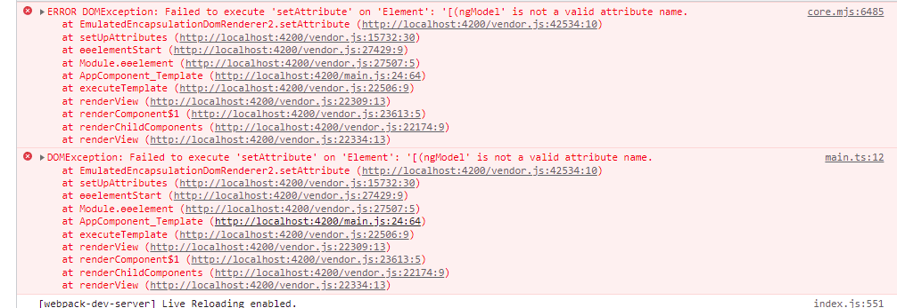
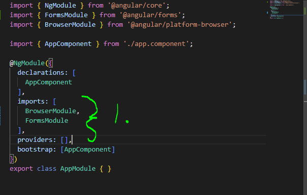

# Section 1: Getting Started

 Getting Started

# What I Learned

- Angular for single page application
- AngularJS(Angular 1) was with flaws. **Should not be using if can**
- Main big change is between **Angular 1** and **Angular 2**
- Angular 2 -> Angular 12... can be called **Angular**

- Angular CLI official one
    - Recomended to create Angular project
    - Good with optimization to code in browser

- NodeJs needs to behind scenes to bundle and optimize Angular
    - We also need **npm** tool from NodeJS

### Setting angular project first time
1. Downloading AngularCLI `npm install -g @angular/cli@latest`
2. `ng new my-first-app --no-strict`
    - after `new` project name
    - `--no-strict` no strict strict mode, for now 
3. ` Would you like to add Angular routing? (y/N)` no for now
4. `Which stylesheet format would you like to use? ` CSS

- We need to do this stuff for typeSript

5. `ng serve` Run development server
    - `ctlr + c` to stop process
- No need to restart after every change, automatically rebuilds
`package.json` describes dependencies
    - `node_modules` is folder for these dependency binaryes

- With Angular you can mix static HMTL and dynamic Angular compoments with data biding

- `{{ title }}` databinding to hmtl, this title is defined in app.component.ts `title = 'mun super äppi';`

-  `(ngModel="name")` directive in Angular, `<input type="text" [(ngModel)]="name">`
    - Listen input and put it into to this input. **Two way databinding**
- Angular is build into different modules, remember to import needed goods
- `app.module.ts` tells Angular which pieces we want it to our application

- to fix remember import NgModule
    - `import { NgModule } from '@angular/core';`

- TS needs imports at top of file alaways

- 1. not connected import which is in top of ts files
    - Understood in Angular what to get into use

- TypeScript is not ran in the browser
    - Compilation is carried out by **CLI**. For this reason we always need project to write TS.TypeScript is compiled to JavaScript