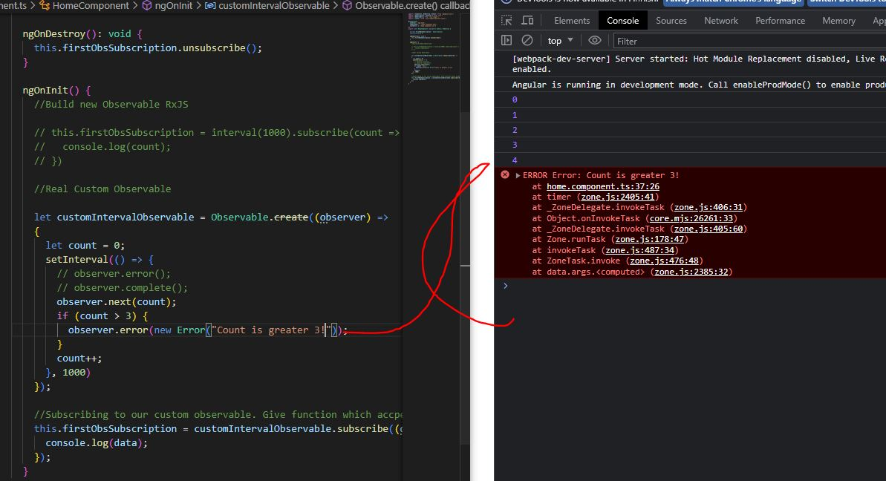

# Section 13: Understanding Observables

 Understanding Observables

# What I Learned

- Observable can be thought as Data Source

- In Angular world Observable can be imported from **RxJS**

- Observable follows observable pattern, we have **Observer** and **Observable** 


1. Data streamline, here **event** is inputted into datastream
  - Example Angular HTTP service does it, when response is **emmitted** as **datapackage**
2. Subscribe function, your code goes here. Here you implement steps which are in mentioned in step **3.**
3. **Hooks** from Angular what happens if some states of **datapackage**

- Observable does not need to finish, example button click cannot finish 
- These tasks are usually async 

- In history, you used **callbacks** and **promises**
  - You **don't** need to use Observerables, its just different approach to handle these events

- Installing required software
- `npm install --save rxjs@6`
- `npm install --save rxjs@6`

- **Handling** observable data which is emmitted

```
    this.route.params.subscribe((params: Params) => {
      this.id = +params.id;
    });
```

- `params` is Observerable. Stream of route params. Subscribes are informed when is changed.
  - Function is passed as handler when stream data is changed 

- Observable are not in **js** or **ts** 
  - Its from RxJS
  - You can see it from package.json as import


- Making our own observable

```
//Imported from
//import { interval } from 'rxjs';

    interval(1000).subscribe(count => {
      console.log(count);
    })
```
- Interval emmits observable where we can subscribe into
  - Happens every second
  - Keep in mind observables don't necessary stop emmitting values if you are not interested in them
    - Some does give on value like, HTTP request emmits one value then they are done

- Remember to **unsubscribe** from any observable if you are not interested in data
  - Memory leaks can be easily introduced
  - We **should** subscriptions


- Now if we click home page where our observable were created, there is now two observable going on in the same time

```
    this.firstObsSubscription = interval(1000).subscribe(count => {
      console.log(count);
    })

  ngOnDestroy(): void {
    this.firstObsSubscription.unsubscribe();
  }
```
- We need start **unsubscribe()** when not needed

```
 this.route.params.subscribe((params: Params) => {
      this.id = +params.id;
    });
```
- Angular specific features are managed by Angular, no need manually unsubscribe them

```
    //Real Custom Observable
    let customIntervalObservable = Observable.create((observer) => 
    {
      let count = 0;
      setInterval(() => { //What does this Observable does
        // observer.error();
        // observer.complete();
        observer.next(count);
        count++;
      }, 1000)
    });

    //Subscribing to our custom observable. Give function which accepts data what we are emmitting
    this.firstObsSubscription = customIntervalObservable.subscribe((data) =>{
      console.log(data);
    });
```
- `observer` is the part where we write our logic for our **OBSERVER** **error**, **finished**, **new data**

- Now our own custom Observable roughly resembles predefined ` interval(1000)` Observer

```
  // this.firstObsSubscription = interval(1000).subscribe(count => {
  //   console.log(count);
  // })
```

- `Observable.create()` we need to create Observable, we tell the handling logic

- We need to tell our Observer, what to do when:
  - **Error** occurred `observer.error();` 
  - When observer **is done** `observer.complete();`
  - Let our observer know about **new data** `observer.next();`

- **Emmitting data** is most important what Observables do
  - Error handling is also important. For example in HTTP request

```
 if (count > 3) {
          observer.error(new Error("Count is greater 3!"));
        }
```
- Throwing error example
  - Error technically cancels Observable. Won't call **Complete** handler



- **Handling error**, after first function comes
  - Throwing error lets observable **die**, completing error is something different

- **Error handler** below  

```
    //Subscribing to our custom observable. Give function which accpets data what we are emmitting
    this.firstObsSubscription = customIntervalObservable.subscribe((data) =>{
      console.log(data);
    }, error => { //handling error
      console.log(error);
      alert(error.message); //Showing error to user
    });
```

- **Completing** observable
  - We could use this in **HTTP request**, it will complete

``` 
if (count == 2) {
  observer.complete(); //Observale comes to hold, its done
}
```

- **Completing handler**

```
 //Subscribing to our custom observable. Give function which accpets data what we are emmitting
    this.firstObsSubscription = customIntervalObservable.subscribe((data) =>{
      console.log(data);
    }, error => { //Erro handler
      console.log(error);
      alert(error.message);
    }, () => { // Completing handler, we could put cleanup process here
      console.log("Completed!")
    }
    );
  }
```
- Complete will **not** be called if observable is cancelled by error

- You **rarely build** your own observables. Usually you build in observables types which come with angular


- 1. We could modify our data from Observable in subcription function
- 2. Using operators is more **elegant** way of handing this

- **Pipes** and **operators** are from `RxJS Operators`

- Every observable has `.pipe()`, example `customIntervalObservable.pipe();`
  - If you have more operators just add to **pipe()**
- We modify data coming out of observable with `pipe()` and `map()`

```
 customIntervalObservable.pipe(map( (data : number) => { //Data is the emmited data which is coming from observable
   return 'Round: ' + ( data + 1);
 }));
```


- Working with operator

```
 //Subscribing to our custom observable. Give function which accpets data what we are emmitting
    this.firstObsSubscription = customIntervalObservable.pipe(map( (data : number) => { //Data is the emmited data which is coming from observable
      return 'Round: ' + ( data + 1);
    })).subscribe((data) =>{
      console.log(data);
    }, error => { //Erro handler
      console.log(error);
      alert(error.message);
    }, () => { // Completing handler, we could put cleanup process here
      console.log("Completed!")
    }
    );
  }
  ```

  - Subject comes handy when we want to do something, in this case show something in different component

  

  - Old way is to use `emmiter` and `*ngIf`

  - With **subject**, you need call `.next()` like this `this.userService.activedEmmitter.next(true);`

  - Subject is **special** type of **observable**

  

  - 1. Observable is rather passive, wraps around callback, event...
  
  - 2. Subject is more **Active**, we can call `next()` from outside, with observables call was from **inside**
    - `observer.next(count);` can be called from outside
  - Example of Observable where calling `.next()` from inside

  ```
    //Real Custom Observable

    let customIntervalObservable = Observable.create((observer) => 
    {
      let count = 0;
      setInterval(() => {
        if (count == 2) {
          observer.complete();
        }
        // observer.error();
        // observer.complete();
        observer.next(count);
        if (count > 3) {
          observer.error(new Error("Count is greater 3!"));
        }
        count++;
      }, 1000)
    });

    ```
 - **Subject** behind scene is bit more efficient than **observable**


- Subject is good to be used if you **communication** between components is trought **services** 

- Todo kehitä syvempää tietämystä kumpaa käytää
  - `@Output` vai (Observable, Subject)

- Todo check advanced resources