# Section 15 Handling Forms in Angular Apps

 Handling Forms in Angular Apps

# What I Learned

- Single page application cannot have **form submit action**
  - Like in traditional html forms
- Angular helps you with forms
  - Checks if form is valid
    - Could make red underlin, if wrong input is found

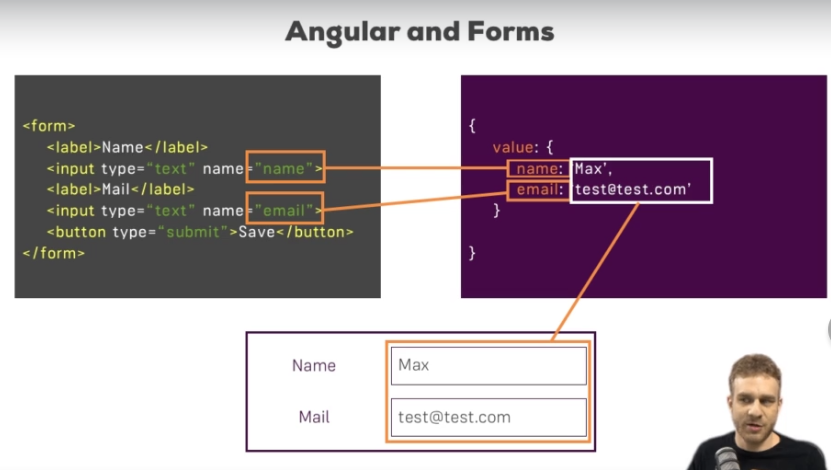


- Exercise files needed to install depencies trought
 `npm install --legacy-peer-deps`

- What we would need
  - We would need to parsing the input values, Js object in your ts code to work with.
- Angular makes Js object representation of your form, to see state of it and work with it

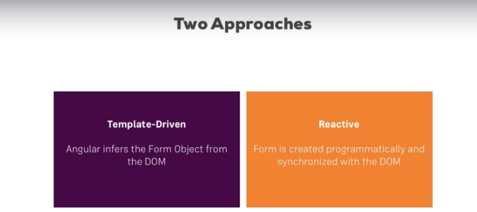

- Angular offer **two** approaches to handle forms
  - **Template-Driven** approach
    - Set form inside template htlm code
  - **Reactive** approach
    - Complex approach
      - Structure of form in ts
  
  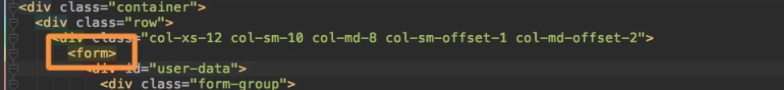

- No action should be spesified with this form, or method attribute
  - We don't want to make HTTP request with this button
    - We want Angluar to take care of this

- To get Angular to hande form need to do these steps:
  - Need import forms module in app.module.ts
  
  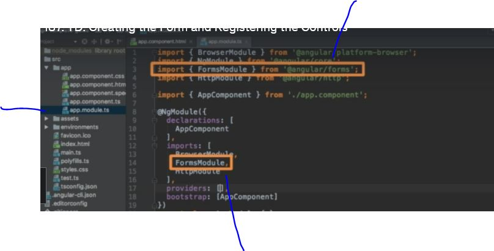

  - After importing think as such, where `<form>` serves as selector for Angular to create Js representation for you.

  - Angular cannot detect input inside form
    - Need to register controls manually
    - To register manually in  **Template-Driven** approach, just add `ngModel` to input you want to controll
      - Then we need to give it HTML attribute, example `name="username"`

  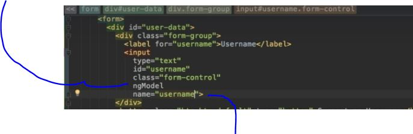

- `<select>` is also input and and its making dropdown list

  ```
 
  <form>
  <button class="btn btn-primary" type="submit">Submit</button>
  </form>
 
  ```
  - Default behaviour button which have type="submit" inside **form**
    - Default behaviour of HTML is fired
      - Js submit event is fired  

- Angular can take advantage of this
  - We could use `(ngSubmit)` directive
    - Will be fired, when submit is occured inside this form

    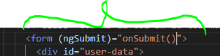
    
    - `OnSubmit()` is called when submit is recognized in form
    - To see **Form Object**
    - To access Form object created by **Angular** inside onSubmit()
    `<form (ngSubmit)="onSubmit(f)" #f="ngForm">`
    - In ts file
    ```
      onSubmit(form : NgForm)
      {
        console.log(form);
      }
    ```

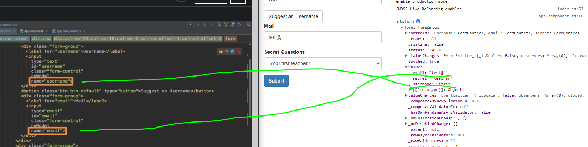

- Capturing NgForm object with specified names on HTML

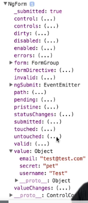

- Form Handling by Angular is realy powerfull, as you can see there is alot of propertyes how Angular manages/controlls *NgForm*

- Some examples, `Dirty` if we changed something inside our form 
- `Disabled` if they are disabled
  - Usercase **Disable** submit button if form is invalid
- `Valid`, if we add  validators to form
- `Touched` if we clicked inside speific field

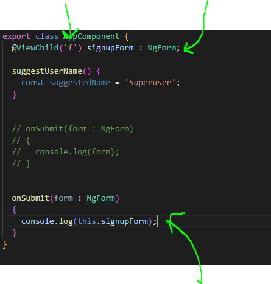

- `f` points to **form object** in our html template. **TODO** palaa tähän kun tutustut `@viewChild`
- Another way to pass form Object is to use `@ViewChild`, works same as previously
  - This is usefull, when  need to access form before submitting

- Input should be valitaded in fortend and in backend

- To add validations in Template-driven approach 

```        
<input
            type="email"
            id="email" 
            class="form-control"
            ngModel
            name="email"
            required
            email
  >
```  

- We need to add validators to **template**
  - `required` HTML attrivbute, but Angular uses this as such
  - `email` dirrective, its form Angular
    - Check valid email address
- Valid is tracked in **Form** level also in **Controll** level

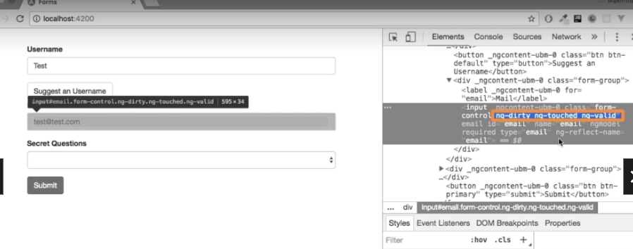

- Angular usess classes to dynamically to give information about state of the form object

- [Validators](https://angular.io/api/forms/Validators)
  - More validators for Template-driven approach, search "validator" [MoreValidators](https://angular.io/api?type=)

> Additionally, you might also want to enable HTML5 validation (by default, Angular disables it). You can do so by adding the ngNativeValidate  to a control in your template

- Taking advantage of form  states handled by angular, disable button if form is invalid

```
     <button
        class="btn btn-primary"
        type="submit"
        [disabled]="!f.valid"
        >Submit</button>
```

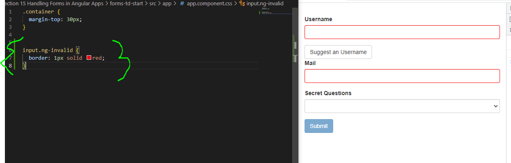

- To add red marks around invalid controlls, we could use css as such 
- Better usage to only if its been touched

```

input.ng-invalid.ng-touched {
  border: 1px solid red;
}

````