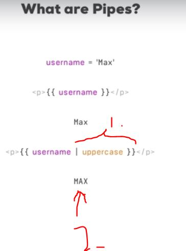
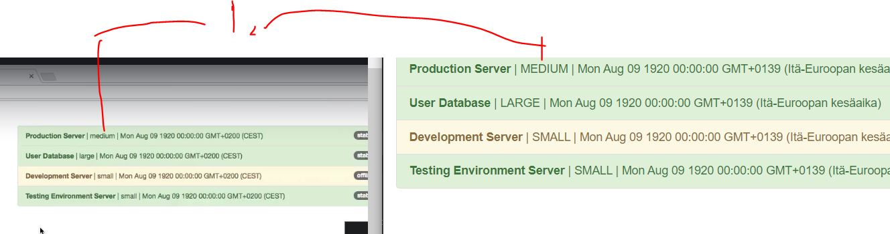
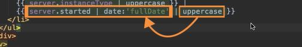
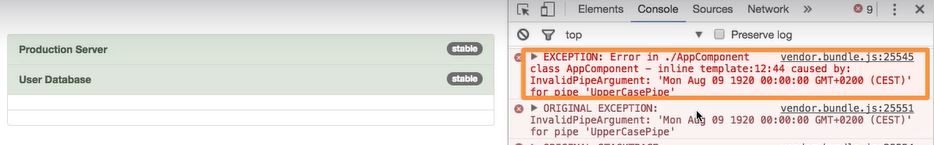
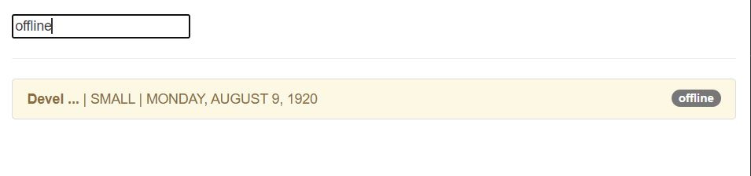

# Section 17 Using Pipes to Transform Output

Using Pipes

# What I Learned

- Pipes transform output in template
    - There are many types of pipes, for synchronous data and asynchronous data
    - Pipes can be added to any output



- 1. Uppercase pipe, build in pipe
- 2. Output of pipe


- Pipes responsibility is to transform data, therefore right place for it to be used is in **template** 


- Using built-in types is easy, just and `|` with pipe

```
{{ server.instanceType | uppercase }}
```

- Will produce result



- Parametrizing pipe `| date :'fullDate'` is to put attributes after `:`

- Pipes can take in multiple arguments, you can look API:s documentation how to use these [here](https://angular.io/api?query=pipe)

- Chaining pipes is possible
    - Order might be important, from left to right



- Uppercase get applied what coming from left

- Orders matter when applying pipes, in this case *uppercase* should be after **date**

`{{ server.started  | uppercase | date :'fullDate' }}`



- When making own pipes, it is recommended to implement following interface **PipeTransform**

```
export class ShortPipe implements PipeTransform {
    
}
```

- Pipes needs to get and needs to give something

- Pipes like other components needs to get added to declaration of ´app.module.ts´ 

- To use our custom pipe, we need to add `@Pipe` decorator
    - Following decorator is called with 'shorten' from template
```
@Pipe({
    name : 'shorten'
})
```

- Parametrizing custom pipe

```

 transform(value: any, limit : number) {
        if (value.length > limit) {
            return value.substr(0,limit) + " ...";
        }
        
        return value;
    }
}

```

- And using it inside template 

``` 

<strong>{{ server.name | shorten:5 }}</strong> | 

```

- Passing argument after **:**

- Generating pipe in CLI `ng generate pipe filter`, generates pipe for name of **filter**

- Pipe can return any data, `string`, `[]` not just true of false 


> Choose the square brackets' property accessor when the property name is dynamic, i.e. determined at runtime.

- Pipe that filters by server status

```
import { Pipe, PipeTransform } from '@angular/core';

@Pipe({
  name: 'filter'
})
export class FilterPipe implements PipeTransform {

  // filteredString, return elements array of aarray matches this filter status
  transform(value: any, filteredString: string, propName: string): unknown {
  //any holds value where pipe is wanted to be applied
    if (value.lenght === 0 || filteredString === '') {
      return value;
    } // nothing to filter

    let resultArray = [];

    for (const item of value) {
      if (item[propName] === filteredString) {
        resultArray.push(item);
      }
    }

    return resultArray;

  }
}
```

- Custom pipe applied to **`*ngFor`** `*ngFor="let server of servers | filter : filteredStatus : 'status'" `




- Angular does not re-run pipe whenever data is changed
    - Changing input of the pipe, will change re-calculation

- It would be realy bad if angular would need re-run pipe every time data somewhere would be updated -> bad for performance 
    - There is no filtering **pipes** inside Angular


- We can **force** update when ever date is update using *pure* decorator

```
@Pipe({
  name: 'filter',
  pure: false
})
```
- [Promise Documentation](https://developer.mozilla.org/en-US/docs/Web/JavaScript/Reference/Global_Objects/Promise/resolve)

- Handling async data, we can use pipe **async**, use after that wants to be evaluated
    - Build in async pipe
```
{{ appStatus | async }} 
```
- Such data would be updated to front-end after data is evaluated, example after promise is returned

## Assignments

- Assignment from 1 can be run after running `npm install --legacy-peer-deps`

- [x] [Assignment 8: Practicing Pipes](#) - Practicing Components


