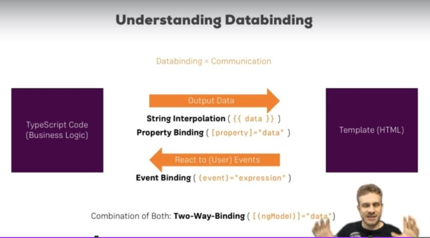
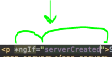
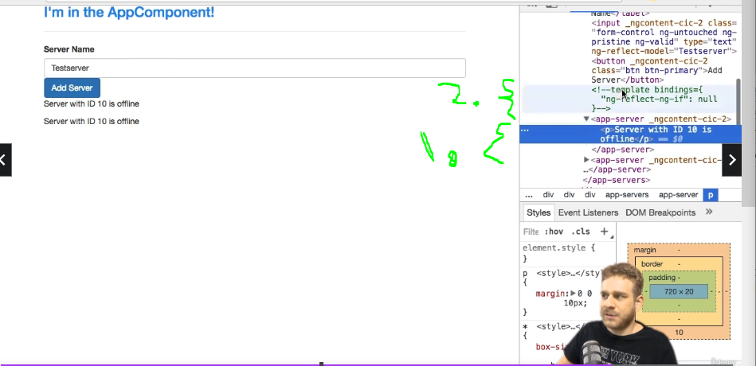
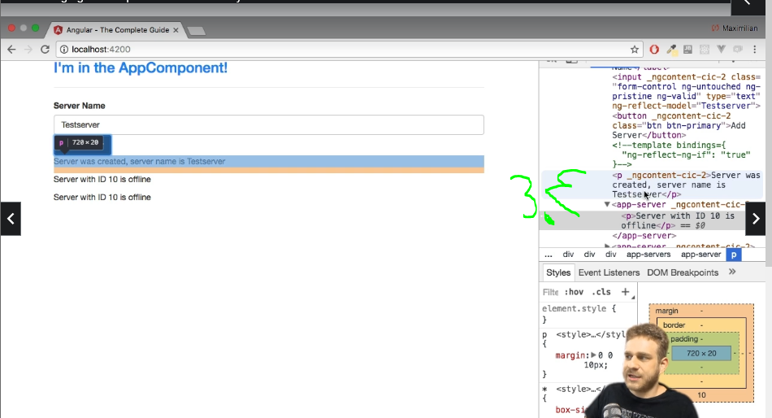
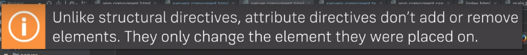
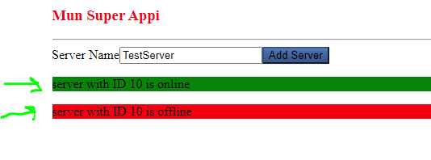
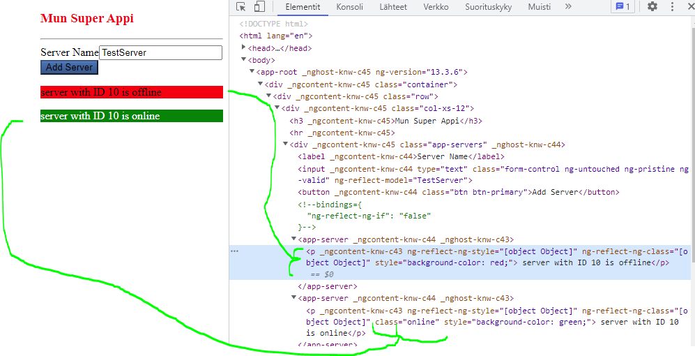
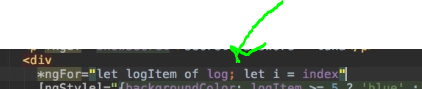

# Section 2 The Basics

The Basics

# What I Learned

- Bootstrap Css, in this course
- `npm install --save bootstrap@3`
    - `@3` Version 3
- `src\styles.css` defines styles for usage in globally
- include bootstrap styles in `angular.json`

```
    "styles": [
        "node_modules/bootstrap/dist/css/bootstrap.min.css",
        "src/styles.css"
    ],
```

- Verifying that bootsrap css is included
    - DeveloperTools/Sources/Css and see comments
    


- app.component.hmtl is rendered 

- inside index.html there `<app-root></app-root>` where angular compoment is imported


- main.ts is started first, it will bootstrap `app.module.ts`
    - `app.module.ts` in return starts spefied component


- Summary of angular bootsrap process


- Angular in the end is JS framework which changes your DOM at runtime!

- Angular allows uss build app in smaller Components
    - Every **C** could be component
    - Every component  would have own html, css, bussiness logic
    - Components allows us to build complex sites into smaller compemets, not just one huge file


- Every Component should have own folder
    - Not hard rule

- Component is just TypeScript class

```
export class ServerCompoment {
    
}
```

- Spesifies that we want to import this class elsewhere 
- Decoratos are to enhance your `.ts` classes/elements
    - `@Compoment()` compoment decorator, decorators are always starts with `@`

- ` import { Component } from `@angular/core`; `
    - We want import Component from `@angular/core`
        - Angular has many packages, one of which have many core features is `@angular/core`

```
@Component({
  selector: 'app-server', //Should use unique selector
})
```
- We can pass JS object to configure angular decorator
    - Will be stored as **metadata** for this class
        - Tells angular what to do with this class
    - `selector` is such important metadata, html tag which u can use in your other compoents later 
- Angular uses **components** to build webpages
    - **Modules** are used to bundle different pieces into packages
- In our current case `app.module.ts` bundles our app
- We need to tell Angluar of our new component

```
import { NgModule } from '@angular/core';
import { FormsModule } from '@angular/forms';
import { BrowserModule } from '@angular/platform-browser';

import { ServerCompoment } from './server/server.component';` // <-- Importing our server.copoment
import { AppComponent } from './app.component';

@NgModule({
  declarations: [
    AppComponent,
     ServerCompoment // <--- We need add new copoments here
  ],
  imports: [
    BrowserModule,
    FormsModule
  ],
  providers: [],
  bootstrap: [AppComponent]
})
export class AppModule { }
```

- app.module.ts is just empty .ts class
    - We transform it to something else using decorators
- `bootstrap: [AppComponent]` Which components u should be aware of when starting application
- ` declarations:` Where to tell components, which **Angular** will be using, also need to tell to **TypeScript** where this Compoment is located `import { ServerCompoment } from './server/server.component';`
- `imports:` imports allows uss add other **modules** to this **module**


- 1. using compements in html is to use selector tag

- We can also create compoments by using **CLI**
    - `ng generate`
        - Generates compoments
- Creating `servers` compoment
    -  `ng generate component servers` or using shorcut `ng g c servers`


- Using our conpoment is our selector tag `<app-server></app-server>`


```
app-servers.component.html

<app-server></app-server>
<app-server></app-server>
```
- We can also nest other components as manytimes we want 
    - now we just use `<app-servers></app-servers>` to get two app-server components

- We can use inline template where we can use html insde ts code

- Each component **needs** **template** to have defined `templateUrl: './servers.component.html'` or `template`
    - We can use these in following manner(redline should be ignore!)


- Use external if much code


- Using `template`, we could use both ways defining template. This could be good if not so much code


- We can define css for component multiline inline using  ` `` `
    - Or using  array notation multiple css files `styleUrls: ['./app.component.css', 'test.css']`
- Using file vs inline depends on how much code there is, like in previous case


- Different ways making selector
    - .class selector
    - by defining attribute
    - typical selector




- Databinging is communication
    - Fetch from server, or finished some calculation
    - We can pass data from Ts code into HTML code inside Template
    - Outputting data to hmtl template:
    - **String Interpolation** `({{ data }})`
        - `{{ }}` String Interpolation syntax
        - Between curly braces you need to put typescript expresion
        - `<p> {{'server'}} with ID {{ serverId }} is {{ serverStatus }}</p>`
        - In the end, returned type needs to be string
            - `{{'server'}}` is returning string  and `{{ serverStatus }}` is type defined inside Component .ts file. Or coul be function ``{{ getServerStatus() }}`
            - Number can be also converted into string in the end
            

    - **Property Binding** `([property]="data")`
    - `[]` square brackets tells angular that we are using **Property Binding**
        - Binds field/state to attribute 
        - example`[disabled]=!allowNewServer` binding to disable, `allowNewServer`attribute
        - Angular works directly on the DOM property and not the HTML attribute.
        - We can also bind to different things, example directives or Angular components. Not always to html element propertyes
    - **Event Binding** `((event)="expression")`

    - **Two-Way-Binding** `([(ngModel)]="data")`
        - React to events and outputting stuff in same time

- Same results can be achieved using **Property Biding** or **String Interpolation**

```
<p>{{ allowNewServer }} </p><!--  Same results can be achieved -->
<p [innerText]="allowNewServer"></p>  <!--  Same results can be achieved -->
```

- **innerText** of element is text between opening and closing tag 
- Printing so text you should use c, change some property use **Property Binding**
    - DONT MIX THESE

```
<p [innerText]="{{allowNewServer}}"></p>
``` 
- There is no **String Interpolation** inside  **Property Biding**  

- Inside **Property Biding**  you need write valid ts code 


- **Event binding**
    - We could use **HTML Event Biding** `onclick="some"`

```
<button class="btn btn-primary"
[disabled]="!allowNewServer"
onclick="some">Add
```

- But, we are going to use **Angulars** Event Binding
    - **Event Binding** Syntax `()` -> `(click)="onCreateServer()"` -> onCreateServer() method which to execute
- Reversed variable name `$event`works only inside event binding

```
(input)="onUpdateServerName($event)"
```
- `$event` holds data and can be passed to click handler


- `$event` works **only** between theese two **"** marks

- Handling/Catching event in ts code

```
  onUpdateServerName(event : Event)
  {
    console.log(event);
    this.serverName = (<HTMLInputElement>event.target).value;
  }
 ```

- Event logged insde chrome console

 

- **target** is **hmtl element** where event was occured
    - **target.value** is what user entered
    - **.value** works only if event is type **IntputElement**
- For this reason we need to tell Ts this is type InputElement explicitly casting it `(<HTMLInputElement>event.target)`
- With this we can fetch input data and output into html temple if needed

 


- Two-way databinding
    - Using both **Property Binding** and **Event Binding** syntax `[()]` 
- `ngModel` is **Directive**

```
<input 
type="text" 
 class="form-control" 
 [(ngModel)="serverName"]>
```

- If input event is fired, serverName is updated
    - **Two-way databinding** reacting to events in both ways


- Components are kinda **Directives**, **instruction** on DOM, `<selector>` in template is telling Angular to place our codes here. An **instricton**

 

- Directive whitout template `appTurnGreen`
- Telling Angular there is this directive

```
@Directive({
    selector:'[appTurnGreen]'
})
```

- Directives are usually added using attribute selector, like in picture below



- Directives shipped with **Angular** like example `ngIf`
    - `ngIf` is used for **conditional** logic
    - `ngIf` is **Structural Directive**
        - When using <p *ngIf=""> `*` is needed, coz **changes structure** of our DOM, hence **Structural Directive**
        - `=""` inside here coz logic which end of the day return **true** or **false**

- This will be always be shown

```
<p>Server was Created, server name is {{ serverName }}</p>
```

- Same, but using ***ngIf=**, will show based on logic between `=""`

```
<p *ngIf="serverCreated">Server was Created, server name is {{ serverName }}</p>
```

- Following code will create such behaviour
- Before clicking bytton we can see
    1. The hook which angular uses to make sure where to insert our paragraph
    2. Our html page whiout `ngIf` modifications

 


3. After click **DOM** was manipulated by `*ngIf`  new element was added, the `<p>` was added to DOM!!! Its not hidden or anything else its **added to DOM**, this is important to realize.


- `#` local reference syntax, using this `#noServer`

- `</ng-template> <ng-template>` Component directive comes with Angular
    - Used to mark places in the DOM.
- And then same with local reference syntax
- `</ng-template #noServer> <ng-template>`

- **Enchanced if** `ngIF` using this would be `<p *ngIf="serverCreated; else noServer">`

- **Enchanced if** applied with **ng-tempate** and **local reference**

```

<p *ngIf="serverCreated; else noServer">Server was Created, server name is {{ serverName }}</p>
<ng-template #noServer>
   <p> No server was created!</p>
</ng-template>

```

- Other type of Directive is **Attribute Directive**
   - whitout `*`



- 'ngStyle'
    - Dynamically update styles 
    - All **'ng'** started are built in Directives shipped with Angular
- `<p [ngStyle]>=""` we binding to property of Directive
    - ngStyle want JS object
    - ngStyle wants color after `=""`
        - `<p [ngStyle]="{backgroundColor: 'red'}">`

```
<!-- html code -->

<p [ngStyle]="{backgroundColor: getColor()}"> {{'server'}} with ID {{ serverId }} is {{ getServerStatus() }}</p>

<!-- ts code -->

getColor()
{
    return this.serverStatus === 'online' ? 'green' : 'red';
}
```




- `ngClass` dynamically add or remove css classes
    - Needs to be using with property binding
    - Accepts key-valye pairs
    - **Key**, class to be attached
        - **Value**, should be this class attached or not
- Using `ngClass`

```
<p 
[ngStyle]="{backgroundColor: getColor()}"
[ngClass]="{online: serverStatus === 'online'}">
```



- Online css .class was attached if server status was online

- `ngFor` could be used it such case where there is static ammount selector elements
    - Structural directive
```
<app-server></app-server>
<app-server></app-server>
```

```
<!-- In ts -->
servers = ['Testserver', 'Testserver 2'];

<!-- In html -->
<app-server *ngFor="let server of servers"></app-server>
```
- `servers` which we defined in **Ts** file
- Will loop trought `servers` induvidual elements and assings it to `server` to be used in this template. Example between `><` marks



- Inside `*ngFor` you can extract extra information using `;` in the end  
    - Allows access index of current location
    `index` is reserved keyword, allows acces to current index in for
    - This can be helpfull if object which you are iterating is not easily countable

```
<div *ngFor="let logItem of log; let i = index"
[ngStyle] = "{backgroundColor : i >= 4 ? 'blue' : 'transparent'}"
[ngClass] = "{'white-text' : i >= 4}"
>{{ logItem }}</div>
```

## Assigments

- Assingments from 1-3 can be run after running `npm install --legacy-peer-deps`


- [x] [Assignment 01](https://github.com/developersCradle/angular-complete-guide/tree/main/Section%202%20The%20Basics/Exercise_1/basics-components) - Practicing Components
- [x] [Assignment 02](https://github.com/developersCradle/angular-complete-guide/tree/main/Section%202%20The%20Basics/Exercise_2/basics-assignment-2-start) - Practicing Databinding
- [x] [Assignment 03](https://github.com/developersCradle/angular-complete-guide/tree/main/Section%202%20The%20Basics/Exercise_3/basics-assignment-3-start) - Practicing Directives

