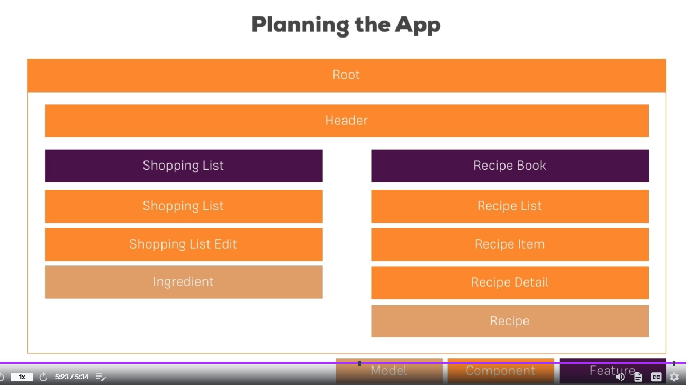

# Section 3  Course Project - The Basics

We will build recipe book and shoping list app
    - Manange, View, modify

# What I Learned

- Little plannig below
- Our App will have Shopping List and Recipe Book applications
- Root will hold application
- Header, will navigate between these two applications
- **Model** Should be very clear, its good to know what information your app will be changing