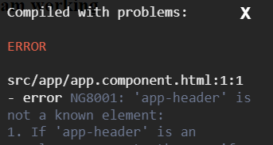
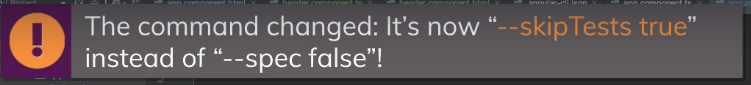
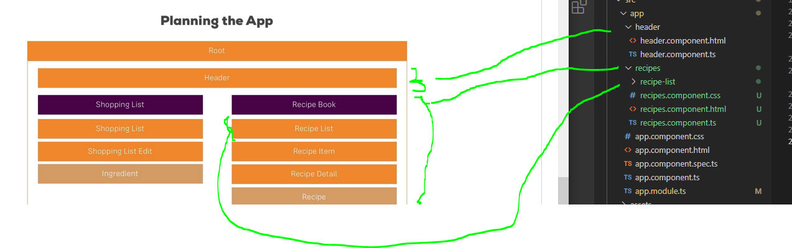
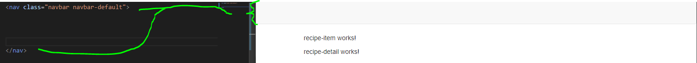
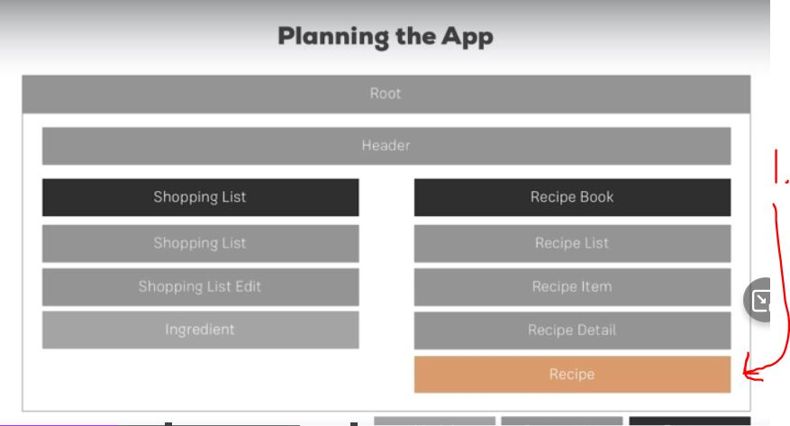
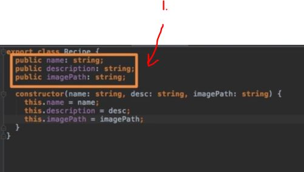
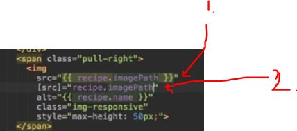

# Section 3  Course Project - The Basics

We will build recipe book and shopping list app
    - Manage, View, modify

# What I Learned


- Little planning below
- Our App will have Shopping List and Recipe Book applications
- Root will hold application
- Header, will navigate between these two applications
- **Model** Should be very clear, its good to know what information your app will be changing



- Common error, `app-header is not a known element`
    - Forgot add to app.module our new component

- Creating component using generator **Old way**  `ng g c recipes --spec false` 
    - **New way** `ng g c recipes --skip-tests`
    - These commands **changes** time to time, check latest one when using this



- `ng g c recipes/recipe-list --skip-tests`
    - Will create `recipe-list` folder inside folder `recipes`



- Its good habit to structure folder by feature as show in upper picture

`<div class="col-md-12">`

- The Bootstrap grid system has four classes: xs (phones), sm (tablets), md (desktops), and lg (larger desktops)



- Bootstrap navbar looks like



- 1. Since **Recipe** is common thought app we should make modal out of this class.
    - It creates layout how this object should work

- Bootstrap **clearfix**(https://getbootstrap.com/docs/4.0/utilities/clearfix/)
    - `<a href="#" class="list-group-item clearfix"></a>`


- Using `*ngFor` in our recipes application

```
<a href="#" class="list-group-item clearfix" *ngFor="let recipe of recipes">
         <div class="pull-left">
            <h4 class="list-group-item-heading">Recipe Name</h4>
            <p class="list-group-item-text">Description</p>
         </div>
         <span class="pull-right">
            
         </span>
      </a>
```



- We can use class fields as such from the class `<h4 class="list-group-item-heading">{{ recipe.name }}</h4>`



1. We can use string interpretation to input our path to image
2. Or use property binding

- Communicating between components is coming later, one important part of Angular application 

- Shopping List needs array of incredients ` <a  style="cursor: pointer" class="list-group-item"></a>`

```
export class Ingredient {
    public name : string;
    public amount: number;
     
    constructor (name : string, amount : number )
    {
        this.name = name;
        this.amount = amount;
    }
}
```
- We can shorter this using, using **accessor**. Example below

```
export class Ingredient {
    constructor (public name : string, public amount : number ) {}
}
```