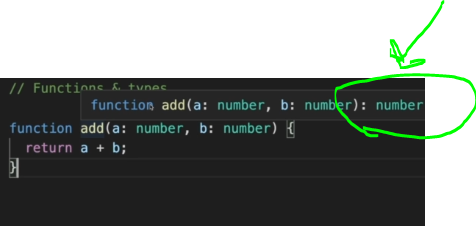
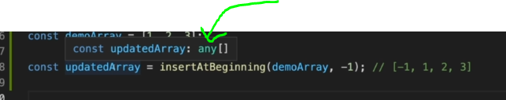
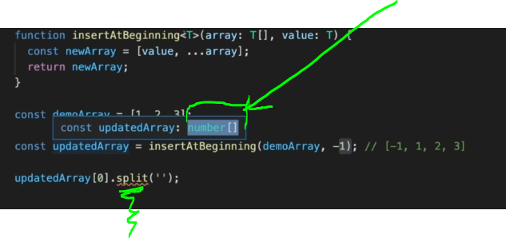

# Section 33 TypeScript Introduction (for Angular 2 Usage)

TypeScript Introduction (for Angular 2 Usage)

# What I Learned

- TypeScript is just extending JavaScript
    - The ts core is js, meaning loops objects are following same syntax as in the js 
- Ts adds **static typing** to js
    - Following code in js creates problem

```

function add(a, b) {
  return a + b;
}

const result = add('2', '5'); // this matters
console.log(result);

```

- Prints "25" while

```

function add(a, b) {
  return a + b;
}

const result = add(2, 5); // this matters
console.log(result);

```

- Prints "7"
- **Static typing**, would prevent this like ts is having
- With TypeScript, this is achieved

```

function add(a: number, b: number) {
  return a + b;
}

const result = add(2, 5);

console.log(result);

```

- `a : number` adding types after variable
- Installing ts for this project
 - `npn init -y`
 - `npm install typescript`
 - TypeScript is not ran in browser, it needs to compiled to js first
 - Invoking ts compiler `npx tsc`, this needs configuration file
  - We can use it `npx tsc with-typescript.ts`

- Error if method is called with wrong parameter, when compiling

```

$ npx tsc with-typescript.ts
with-typescript.ts(5,20): error TS2345: Argument of type 'string' is not assignable to parameter of type 'number'.

```

- Primitive types in Ts
  - Number `let age : number;`
  - String `let username : string;`
  - Boolean `let isInstructor : boolean;`
- Remember to use lowercase version, with uppercase it points to **object** `Number`
- Complex types
  - Object with **any** type `let person : any;`
    - Should not use `any` type since it will go back to js and defeat its purpose

``` 

let person : any; //Object

person = {
    name : 'Max',
    age: 32 
 };

```
  - Arrays of certain type 
  
```
  
  let hobbies : string[]; 
  hobbies = ['Sport', 'Cooking'];
  
```
  - We can use TypeScript object type defination syntax, `{}` and to use it `let person : {};`
    - We are defining structure of an object, like `struct` keyword in c++
    - Using defining structure of an object
```

let person : {
    name : string,
    age : number;
}; // Ts objec type defination syntax

person = {
    name : 'Max',
    age: 32 
};

```
  - We can combine this this to strings also, notice `[]` in the end
    - Following tells arrays contains these object with these types inside

```

let personsArray : {
    name : string,
    age : number;
}[]; // personsArray contains array these objects

```

- Ts assings type to variable behind scenes, if you forget to do so. Actually this is preferred, since it saves time 

```

//Type inference
let course = 'React' //This is same as, " let course : string = 'React' "
course = 2231; //Error coz ts uses behind scenes type inference

```

- **Union types**, type allows more than 1 type

```
let unionType : string | number = "React";
unionType = 1212;
```
- `unionType` is now allowed to have **string** or **number**

- `type` alias does not exist in standard js, its from TypeScript

- Using type alias, saves not using type again

```

type Person = {
    name : string;
    age : number;
};

let person1 : Person; //now person1 is type Person
//also possible
let peopleArray : Person[]; // now personArray is type Person array

```

- Allow numbers into function

```

function add(a : number,b : number) { 
    return a+b; //infer type to return, ts will have to figure this out 
}

```
- Ts will infer this return type, as in following picture from IDE. In this case number



- **OR**
- Telling return value with union type `: number | string ` or with one type `: number`. Both possible
```

function add(a : number,b : number) : number | string { 
    return a+b; //
}

```
- If **no reason** to spesify type, should let Ts to infer the return type

- `: void` will return nothing in case of function defination


- Generics will come in handy in following scenario

```

function insertAtBeginning(array : any[], value : any)
{
    const newArray = [value, ...array]; //Spread operator
    return newArray;
}

const demoArray = [1, 2, 3];

const updatedArray = insertAtBeginning(demoArray, -1); // [-1, 1, 2, 3]
// const stringArray = insertAtBeginning(['a', 'b', 'c'], 'd');

```



- Ts does not know what kind of values `updatedArray` would hold.  

- Problem comes if one would use such `insertAtBeginning()` helper function with numbers and then happens to call `updatedArray[0].split('');` on an **number**(gives run time error), this would work if `updatedArray` would be full of **strings!**

- Here generics comes help. Generics are from **TypeSript** feature `<>`
  - Same code, but with **generics**

```

function insertAtBeginning<T>(array : T[], value : T) // Same with generics
{
    const newArray = [value, ...array]; //Spread operator
    return newArray;
}

```



- Now Ts knows that we are working with array of **numbers**, and won't let uss call string related funtions like `split()`

- Making class in ts/js

```

class Student {
    // firstName: string;
    // lastName: string;
    // age: number;
    // private courses: string[];
  
    constructor(
      public firstName: string,
      public lastName: string,
      public age: number,
      private courses: string[]
    ) {}
  
    enrol(courseName: string) { // Method, no function keyword!
      this.courses.push(courseName);
    }
  
    listCourses() {
      return this.courses.slice();
    }
  }
  
  const student = new Student('Max', 'Schwarz', 32, ['Angular']);
  student.enrol('React');
  
  ```

  - Making method, remember not use **function keyword**

  ```

   enrol(courseName: string) { // Method, no function keyword!
      this.courses.push(courseName);
    }

  ```

 - These are the same
 
 ``` 
 
  class Student {
  // firstName: string;
  // lastName: string;
  // age: number;
  // private courses: string[];

  constructor(
    public firstName: string,
    public lastName: string,
    public age: number,
    private courses: string[]
  ) {}
}

```

- And this

```

class Student {
  // firstName: string;
  // lastName: string;
  // age: number;
  // private courses: string[];

  constructor(
     firstName: string,
     lastName: string,
     age: number,
    courses: string[]
  ) {}

```