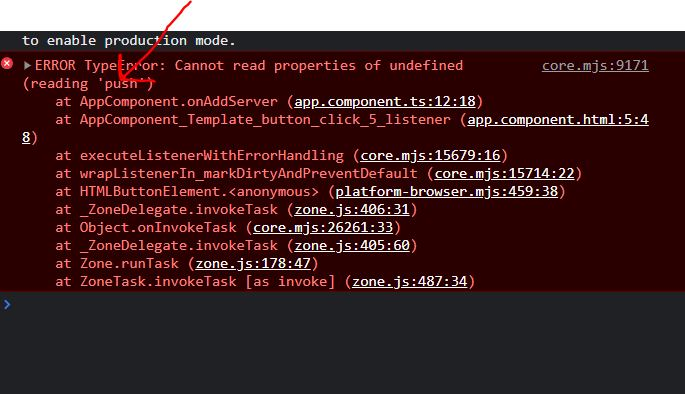
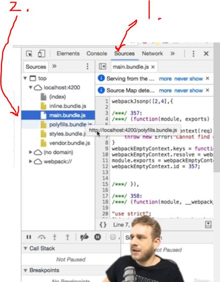
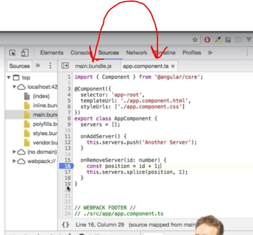
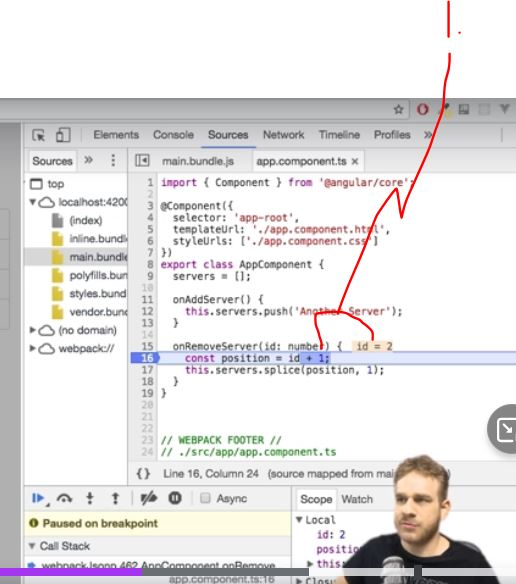
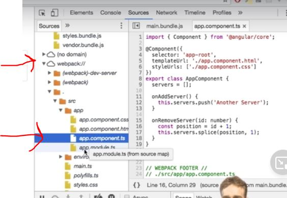

# Section 4 Debugging

Debugging Angular application

# What I Learned

- Angular apps are merged in the end, **meaning** if error message points to certain line of the file. It won't be necessarily in corresponding file in **IDE**

- Not initialized correctly

- 1. We can debug in live code
- 2. Loaded bundles inside chrome 

- After loading .js files to browser
    - **Source Maps** allows us map .js files to .ts, mapping to each other
    - Therefore we can start placing **bp** in js code allows us catch and debug in ts in real-time 

    
- 1. We can see content live inside Chrome developer tools even if bd was places in js file, thx to **Source Mapping**

- .ts file can be accessed trough **webpack** manually