# Section 5 Components & Data binding Deep Dive

Components & Data binding Deep Dive

# What I Learned

- Bundling angular app in smaller components can be beneficial

- [cli commands](https://angular.io/cli/generate)
 
- Creating component at the time was `ng g c cockpit --skip-tests`

- Passing data between elements property & Event Binding
    - We send events and tell listen to some event

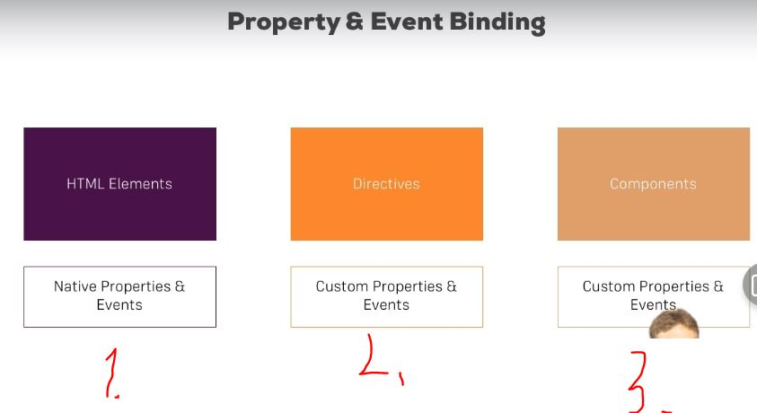

- 1. We can bind event binding to normal HTML elements
- 2. To directives, for exmample`ngClass` and `ngStyle`
- 3. To bind to our own element or invoking our **own** events

- `element : {}; ` element is JS Object


- Binding custom error 

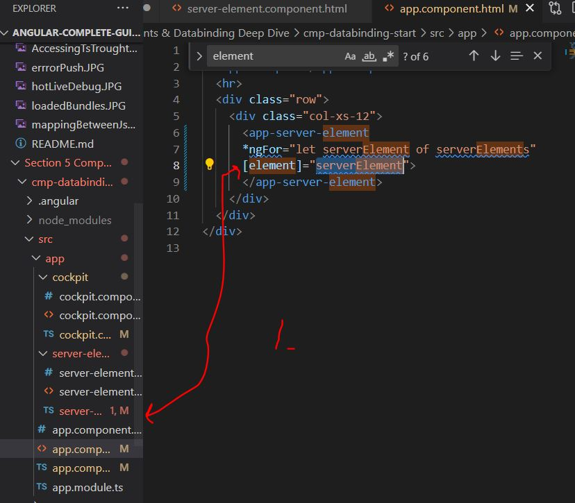

- 1. We cannot bind `element` from other component whiteout
    - By **default** all properties of component are accessible from within itself**
        - Generally good thing 
        - We can use **decorator** `@Input()` before field to make its parents able to access it.
            - Example. `@Input() element : { type : string, name : string, content : string};`
- We can access parent element using `[element]="serverElement"`

```

<div class="container">
  <app-cockpit></app-cockpit>
  <hr>
  <div class="row">
    <div class="col-xs-12">
      <app-server-element
      *ngFor="let serverElement of serverElements"
      [element]="serverElement">
      </app-server-element>
    </div>
  </div>
</div>

```

- [input](https://angular.io/guide/inputs-outputs)

- We can make **alias** to access property from outside this component

```
@Input('srvElement') element : { type : string, name : string, content : string};
```

- `<app-cockpit (serverCreated)="onServerAdded($event)"></app-cockpit>`
    - App-cockpit is listening event **(serverCreated)** and when happening, it will call **onServerAdded($event)**

`serverCreated = new EventEmitter<{serverName : string, serverContent : string}>();`

- `EventEmmitter` allow **emmit** own events
- `serverCreated` is now emitting events,
    - **<>** Data which data will be emmitting and and **()** to call constructor of emmitter

```
  onAddBlueprint() {
    this.blueprintCreated.emit({
      serverName: this.newServerName, 
      serverContent : this.newServerContent
    });
  }
```

- Emitting own our custom event by calling *.emit*

- Decorator passing something out of the component `@Output()`

- Example using output operator for following event 

`@Output() blueprintCreated = new EventEmitter<{serverName : string, serverContent : string}>();`

- Component communication is **key** feature of Angular

- There comes limit when making listener and output emmitter between two component is too great. This is resolved using services.

- Angular **encapsulates** .css to where Angular component belongs to.

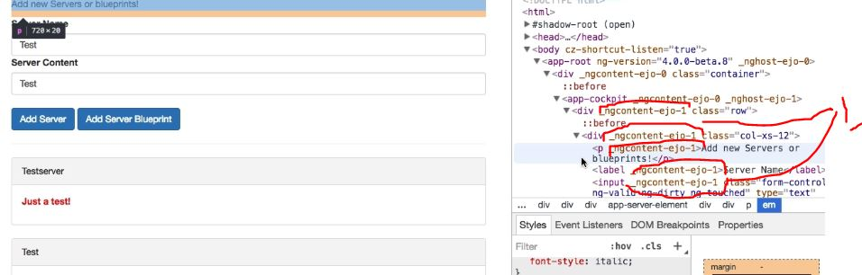

1. Angular enforces .css encapsulation by making use of attributes. **1.** following attributes are applied to specific component

- Angular Emulates shadow DOM
  - Shadow DOM is not supported by all browsers, so Angular emulates this.

- To disable components view encapsulation we can set using `encapsulation: ViewEncapsulation` Decorator

```
@Component({
  selector: 'app-server-element',
  templateUrl: './server-element.component.html',
  styleUrls: ['./server-element.component.css'],
  encapsulation: ViewEncapsulation.N
})
```

 - `encapsulation: ViewEncapsulation.None` removes view encapsulation 

 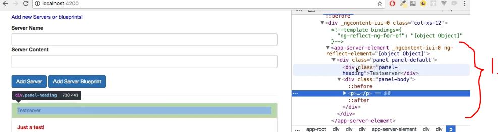

 - We cannot see these attributes anymore

-  `encapsulation: ViewEncapsulation.Native`
 uses ShadowDom

 - [ShadowDOM](https://developer.mozilla.org/en-US/docs/Web/API/Web_components/Using_shadow_DOM)

 - As reminder, this is for event binding `()`

 - We can consider replacing two-way data binding with **local reference** `#serverNameInput`
  - This will hold reference to whole **element**, not just to value at the element

  - We can pass the reference only in the **template** not in **ts file**

  - Example using local reference 

  ```
  <input 
      type="text" 
      class="form-control" 
      #serverNameInput>
  ```

- We can access before call method using **ViewChild** `@ViewChild('serverContentInput'`
  - We can also pass type of element here
  - `@ViewChild('serverContentInput', {static: true}) serverContentInput: ElementRef;` Passing type as ElementRef. ElementRef is Angular type

- Bad way manipulating DOM `// this.serverContentInput.nativeElement.value = 'Something'; This is bad way manipulating DOM element`
  - Should use String Interpolation or Property Binding if you want to show something in the DOM
  
  - `<app-server-element></app-server-element>` inside angular component everything is ignored, until special key hook is placed **directive** element like selector `<ng-content>`

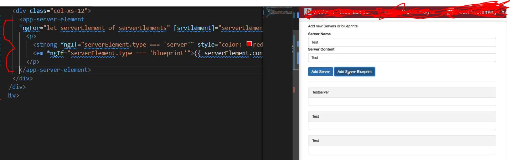

- As you can see styles are not applied, **everything placed between opening and closing tags of the component is lost**

- 1. This content is placed where the `<ng-content>` hook was defined  

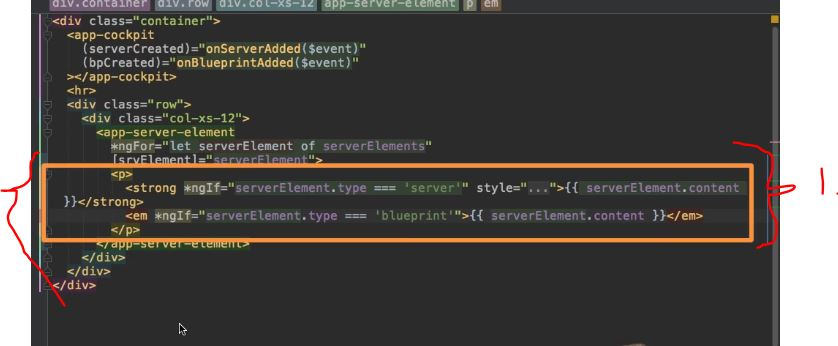

- Not it will be projected into the **hook place**

- `ngOnInit()` is lifecycle hook, there is many lifecycle hooks in Angular

- When new component is created, there will be different lifecycle hooks, these phases are

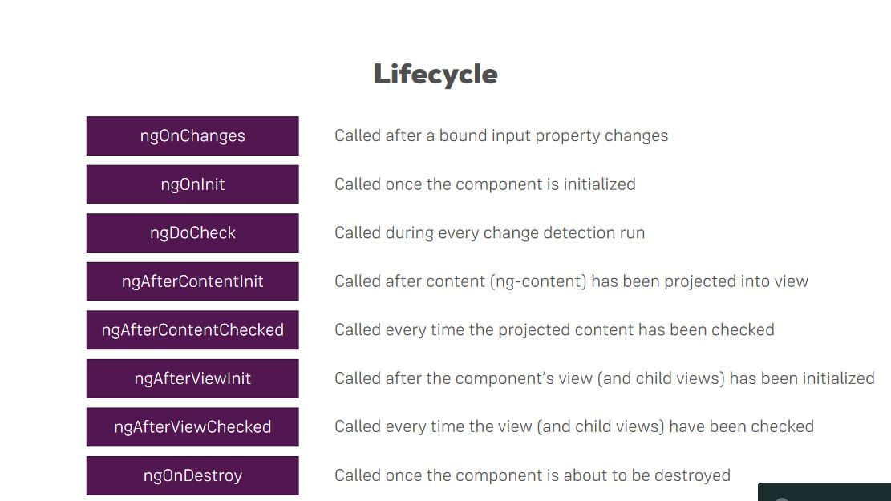

- `ngOnChanges()` will be called many times
  - Will be called before `ngOnInit()` 
  - Needs to parameter to passed in `changes: SimpleChanges`

- `ngOnInit()` will be called after constructor, when object is created

- `ngDoCheck()` when change detection is ran, when something changed inside template, or event is present. 

- `ngAfterContentInit()` ran after content been projected such as `ng-contet`

- `ngAfterViewChecked()` after our view have been rendered

- When using lifeCycle hooks, you should remember to implement interface

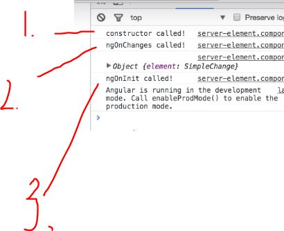


- Simple changes gets passed in 

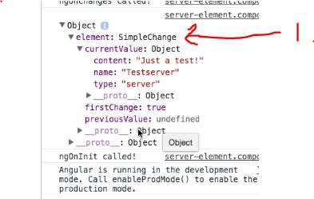

- 1. As you can see **SimpleChanges** holds element is bounded, which we previously defined
  - Content, name, type

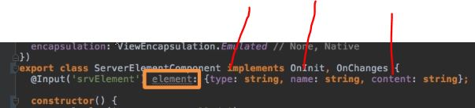

- TODO heikki, selvitä mikä ero on kun Bindaus tapahtuu objectiin tai primitiivisen kentään. (Joku vaikutus Angularin Hook:ien kutsumiseen)

<!--

- When changing binded property, change from reference or change on object can be different.
  - Will not trigger `ngOnChanges()`, depends on how was changes made, trough **reference** or **Object**

-->

- When firing such change

```
onChangeFirst(){
  this.serverElements[0].name = 'Changed!'; referenc
}
```

```
@Input() name : string;
```
- When binded to primitive field, `ngOnChanges()` should be called in both components when value is updated 

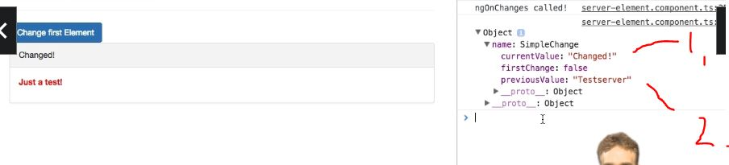

- **Constructor** and **ngOnInit()** were not called
- You could use this if you want process before something is changing. **1.** Value to be updated and **2.** Value what was before.

- `ngDoCheck()` When angular checks for **any** changes, many checks happens here

- `ngAfterContentInit()`

